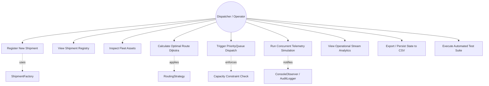
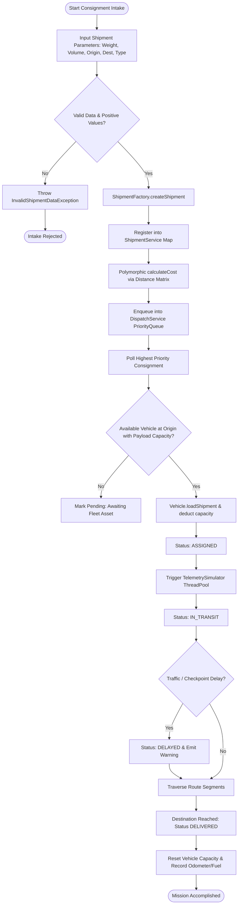
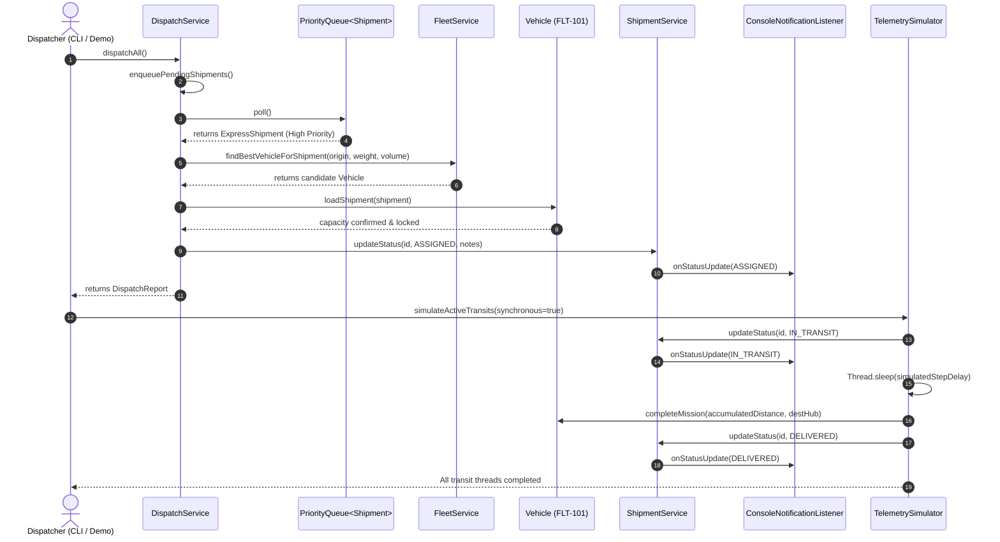
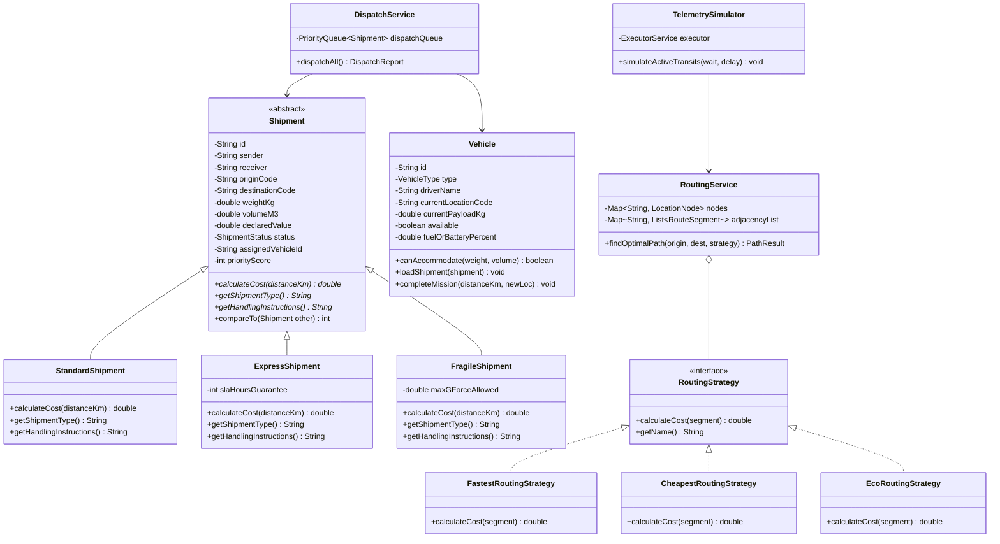

# ACADEMIC PROJECT REPORT

# LogiFlow Pro: Intelligent Logistics & Freight Dispatching System

---

## SECTION 1: COVER PAGE

* **Course Title:** Programming in Java
* **Course Code:** CSE1007 / SWE1004 (Java Flipped Course Evaluation)
* **Project Title:** LogiFlow Pro: Intelligent Multi-Modal Logistics & Freight Dispatching System
* **Domain:** Distributed Supply Chain Systems, Graph Pathfinding, Concurrent Telemetry Simulation
* **Date of Submission:** September 18, 2026
* **Academic Term:** 2026 Academic Evaluation Cycle
* **Repository Visibility:** Public GitHub Repository
* **Execution Interface:** Pure Command-Line Interface (Terminal / CLI)
* **Target Audience:** Course Evaluators, Academic Examination Committee, Software Architects

---

## SECTION 2: INTRODUCTION

In the era of hyper-connected global commerce and distributed supply networks, logistics infrastructure forms the critical backbone of industrial economies. The management of freight transit networks involves complex optimization challenges: intake of diverse cargo with varying handling and priority specifications, optimal route computation across intermodal transit corridors, dynamic capacity-constrained allocation of transport assets, and continuous monitoring of distributed fleets under uncertain operating conditions.

Traditional freight dispatch systems frequently suffer from brittle, monolithic architectures. They rely on static routing heuristics that fail to factor in real-time constraints such as road tolls, transit durations, and carbon emissions. Furthermore, they lack the concurrent telemetry processing necessary to manage fleet status transitions dynamically.

**LogiFlow Pro** was conceived and engineered as an advanced, resilient, and fully modular logistics management engine implemented in pure Java. Developed to demonstrate mastery of modern Object-Oriented Programming (OOP) paradigms, the system models real-world freight operations through clean domain abstractions, creational/behavioral design patterns, graph pathfinding algorithms (Dijkstra), priority scheduling queues, and multi-threaded sensor telemetry simulators.

---

## SECTION 3: PROBLEM STATEMENT

### Context and Core Problem
Modern logistics hubs manage thousands of tons of cargo daily. Operating efficiency hinges on four core problems:
1. **Heterogeneous Cargo Handling:** Freight varies drastically in priority, fragility, and pricing structures. A uniform billing or dispatching approach causes revenue leakage and damage to delicate cargo.
2. **Sub-optimal Pathfinding:** Hub-to-hub routes must balance transit duration, financial costs (fuel and tolls), and sustainability targets (carbon footprints). Rigid point-to-point routing produces excessive travel time and fuel consumption.
3. **Dispatch Starvation & Capacity Violations:** Dispatching without priority weighting can leave time-critical consignments stranded while standard bulk freight consumes limited fleet capacity. Overloading vehicles violates safety regulations and induces vehicle wear.
4. **Lack of Real-Time Concurrency:** Synchronous tracking systems cannot simulate or process simultaneous vehicle movements, leading to bottlenecks and inaccurate ETA projections.

### Project Goals
LogiFlow Pro solves these challenges by providing:
* An extensible Object-Oriented inheritance hierarchy for polymorphic cargo classification and tariff calculations.
* A graph-based pathfinding engine utilizing Dijkstra's algorithm with pluggable strategies (*Fastest*, *Cheapest*, *Eco-Optimized*).
* A `PriorityQueue`-driven greedy dispatch matcher that prioritizes urgent freight and strictly enforces weight and volumetric constraints.
* A multi-threaded simulation engine utilizing Java's `ExecutorService` and `CountDownLatch` to simulate concurrent vehicle journeys across interstate transit corridors.
* An operational analytics dashboard powered by the Java Stream API for real-time KPI generation.
* Robust persistence and audit logging guaranteeing tamper-evident traceability.

---

## SECTION 4: FUNCTIONAL REQUIREMENTS

LogiFlow Pro includes four major functional modules:

### Module 1: Fleet & Consignment Management
* **FR-1.1:** Support registration and classification of multiple shipment types: *Standard*, *Express*, and *Fragile*.
* **FR-1.2:** Compute polymorphic shipping tariffs based on distance, cargo weight, volume, declared asset value, SLA guarantees, and specialized fragility insurance.
* **FR-1.3:** Maintain an active registry of fleet vehicles categorized into *Delivery Vans*, *Medium Duty Trucks*, *Semi-Trailers*, and *Electric Urban Haulers*.
* **FR-1.4:** Enforce physical constraints: maximum payload weight (kg) and volumetric cargo space (m³).

### Module 2: Network Graph Pathfinding & Corridor Optimization
* **FR-2.1:** Model transit topology with intermodal logistics nodes (Hubs: JFK, ORD, ATL, DFW, DEN, LAX, SEA, MIA) and directional route segments.
* **FR-2.2:** Compute optimal transit paths using Dijkstra’s shortest path algorithm.
* **FR-2.3:** Provide runtime-switchable routing strategies via the Strategy Design Pattern:
  * *Fastest Route:* Minimizes cumulative transit hours.
  * *Cheapest Route:* Minimizes fuel and toll expenditures.
  * *Eco-Friendly Route:* Minimizes carbon emissions based on corridor green-scores.

### Module 3: Priority Dispatch & Fleet Allocation Engine
* **FR-3.1:** Maintain an internal dispatch scheduling queue backed by a `PriorityQueue`, automatically ordering shipments by priority score and creation timestamp.
* **FR-3.2:** Execute automated capacity-constrained matchmaking to assign queued consignments to available fleet vehicles stationed at the departure hub.
* **FR-3.3:** Transition shipment states (`CREATED` $\rightarrow$ `ASSIGNED`) and lock vehicle availability.

### Module 4: Concurrent Telemetry & Incident Simulation
* **FR-4.1:** Concurrently simulate transit progress of active vehicles across geographic waypoints using a background thread pool (`ExecutorService`).
* **FR-4.2:** Inject dynamic operational incidents (e.g., traffic bottlenecks, checkpoint delays) with real-time ETA adjustments.
* **FR-4.3:** Coordinate concurrent execution using `CountDownLatch` and emit event notifications through the Observer Design Pattern.
* **FR-4.4:** Advance shipment states (`ASSIGNED` $\rightarrow$ `IN_TRANSIT` $\rightarrow$ `DELIVERED`).

### Module 5: Operational Analytics & Reporting
* **FR-5.1:** Aggregate gross revenue, revenue breakdowns per shipment type, and status distribution using Java 8+ Stream collectors.
* **FR-5.2:** Compute statistical summaries (`DoubleSummaryStatistics`) for cargo weights and consignment values.
* **FR-5.3:** Track environmental impact by logging fleet carbon emissions ($kg\ CO_2$).

### Module 6: Persistence & Audit Logging
* **FR-6.1:** Serialize and deserialize shipment records to and from persistent CSV storage (`data/shipments.csv`).
* **FR-6.2:** Record all operational actions, status transitions, and exceptions to a thread-safe, timestamped audit log (`data/audit.log`).

---

## SECTION 5: NON-FUNCTIONAL REQUIREMENTS

| Category | Requirement Specification |
| :--- | :--- |
| **NFR-1: Performance & Latency** | Pathfinding computations across 20+ transit corridors must execute in under 10 milliseconds. The entire test suite must complete execution in under 500 ms. |
| **NFR-2: Thread Safety & Concurrency** | All shared fleet and shipment registries must use thread-safe data structures (`ConcurrentHashMap`, synchronized blocks) to prevent race conditions during concurrent telemetry simulations. |
| **NFR-3: Reliability & Fault Tolerance** | The system must never terminate unexpectedly due to invalid input. Custom checked exceptions (`InsufficientCapacityException`, `RouteNotFoundException`, etc.) must trap errors gracefully and report actionable diagnostic messages. |
| **NFR-4: Portability & Zero External Dependencies** | The application must execute natively on any standard JDK (Java 17+) on Windows, Linux, and macOS without requiring Maven, Gradle, or internet connectivity. |
| **NFR-5: Maintainability & Code Quality** | Clean separation of concerns across `model`, `service`, `pattern`, `storage`, and `exception` packages adhering strictly to SOLID principles and Clean Code conventions. |
| **NFR-6: Auditability & Security** | All operational status transitions and vehicle departures must produce immutable, timestamped audit log entries with precision down to the millisecond. |

---

## SECTION 6: SYSTEM ARCHITECTURE

LogiFlow Pro is structured using a Layered Architecture comprising Presentation, Service, Domain/Pattern, and Data Persistence layers:

```
+-----------------------------------------------------------------------+
|                       PRESENTATION / CLI LAYER                        |
|  - Main.java (Interactive Console Menu, Automated Demo Runner)        |
|  - ConsoleNotificationListener.java (Observer Terminal Output)        |
+-----------------------------------------------------------------------+
                                   |
                                   v
+-----------------------------------------------------------------------+
|                            SERVICE LAYER                              |
|  - RoutingService      : Dijkstra Graph Algorithm & Pathfinding       |
|  - DispatchService     : PriorityQueue Matchmaking & Allocation       |
|  - TelemetrySimulator  : Multithreaded Transit Engine (Thread Pool)   |
|  - FleetService        : Fleet Tracking & Capacity Verification       |
|  - ShipmentService     : Shipment Lifecycle & Observer Subject        |
|  - AnalyticsService    : Java Stream API KPIs & Financial Aggregation |
+-----------------------------------------------------------------------+
                                   |
                                   v
+-----------------------------------------------------------------------+
|                        DOMAIN & PATTERN LAYER                         |
|  - Models    : Shipment, Standard, Express, Fragile, Vehicle, Node    |
|  - Patterns  : Factory (ShipmentFactory), Strategy (RoutingStrategy), |
|                Observer (Subject/Observer), Singleton (AuditLogger)   |
|  - Exceptions: LogisticsException hierarchy (Capacity, Route, etc.)   |
+-----------------------------------------------------------------------+
                                   |
                                   v
+-----------------------------------------------------------------------+
|                       STORAGE & PERSISTENCE LAYER                     |
|  - FilePersistenceManager : CSV Reader/Writer (shipments & routes)    |
|  - AuditLogger            : Synchronized Thread-Safe Transaction Log  |
+-----------------------------------------------------------------------+
```

---

## SECTION 7: DESIGN DIAGRAMS

### 7.1 Use Case Diagram



---

### 7.2 Workflow Diagram: Shipment Lifecycle & Dispatch Workflow



---

### 7.3 Sequence Diagram: Automated Dispatch & Telemetry Sequence



---

### 7.4 Class / Component Diagram



---

### 7.5 Database & Storage Schema Design

LogiFlow Pro utilizes flat-file relational CSV data representations and an append-only transaction audit log:

#### Table 1: `data/sample_shipments.csv` (Shipment Entity Schema)
| Column Name | Data Type | Constraint | Description |
| :--- | :--- | :--- | :--- |
| `id` | VARCHAR(20) | PRIMARY KEY | Unique tracking identifier (e.g., `SHP-1001`) |
| `type` | VARCHAR(15) | NOT NULL | Shipment classification (`STANDARD`, `EXPRESS`, `FRAGILE`) |
| `sender` | VARCHAR(50) | NOT NULL | Name of consignor entity / business |
| `receiver` | VARCHAR(50) | NOT NULL | Name of consignee entity / recipient |
| `origin` | CHAR(3) | FOREIGN KEY | Origin distribution hub code |
| `destination` | CHAR(3) | FOREIGN KEY | Destination distribution hub code |
| `weightKg` | DECIMAL(8,2) | > 0 | Gross parcel weight in kilograms |
| `volumeM3` | DECIMAL(6,3) | > 0 | Dimensional volumetric footprint in cubic meters |
| `declaredValue` | DECIMAL(10,2) | >= 0 | Declared monetary insurance valuation in USD |
| `status` | VARCHAR(20) | ENUM | Lifecycle state (`CREATED`, `ASSIGNED`, `IN_TRANSIT`, `DELIVERED`) |
| `assignedVehicleId` | VARCHAR(20) | NULLABLE | Identifier of assigned fleet vehicle unit |
| `extraParam` | DECIMAL(6,2) | DEFAULT 0 | SLA hours (for Express) or Max G-Force (for Fragile) |

#### Table 2: `data/network_routes.csv` (Corridor Edge Schema)
| Column Name | Data Type | Constraint | Description |
| :--- | :--- | :--- | :--- |
| `sourceCode` | CHAR(3) | PRIMARY KEY (Composite) | Origin node code (e.g. `JFK`) |
| `destinationCode` | CHAR(3) | PRIMARY KEY (Composite) | Destination node code (e.g. `ORD`) |
| `distanceKm` | DECIMAL(8,2) | > 0 | Highway corridor distance in kilometers |
| `estimatedHours` | DECIMAL(5,2) | > 0 | Normal transit duration under posted speed limits |
| `tollCost` | DECIMAL(6,2) | >= 0 | Commercial highway toll surcharge in USD |
| `ecoScore` | DECIMAL(3,1) | 1.0 - 10.0 | Environmental suitability index rating |

#### Table 3: `data/audit.log` (Operational Transaction Log Format)
`[YYYY-MM-DD HH:mm:ss.SSS] [LEVEL] [COMPONENT      ] Message Text`

---

## SECTION 8: DESIGN DECISIONS & RATIONALE

1. **Pure Java Standard Edition (Zero Third-Party Dependencies):**
   * *Rationale:* The academic evaluation environment requires zero setup friction. Relying on Maven, Gradle, Spring Boot, or external databases often introduces environment PATH failures or dependency resolution timeouts. Implementing pure Java guarantees immediate, out-of-the-box execution on any JDK 17+ system.
2. **Strategy Pattern for Routing Algorithms:**
   * *Rationale:* In supply chain logistics, route optimality is multi-dimensional. A client shipping perishable pharmaceuticals prioritizes time (*Fastest*), while bulk grain shippers prioritize freight tolls (*Cheapest*), and ESG-focused enterprises prioritize emissions (*Eco*). The Strategy pattern decouples path calculation from the graph traversal implementation.
3. **PriorityQueue for Freight Scheduling:**
   * *Rationale:* FIFO queues lead to starvation of urgent items. By implementing `Comparable<Shipment>` and ordering by `priorityScore` descending, Express and Fragile goods automatically jump ahead of Standard bulk shipments without requiring costly sort operations.
4. **ExecutorService and CountDownLatch for Concurrency:**
   * *Rationale:* Simulating vehicle movements sequentially does not model real-world concurrency. By assigning each vehicle mission to a worker thread and using `CountDownLatch`, the main thread can coordinate batch completions without polling loops.
5. **Checked Custom Exception Hierarchy:**
   * *Rationale:* Java's checked exceptions force explicit handling at architectural boundaries. Defining `LogisticsException` as the root parent with subtypes (`ShipmentNotFoundException`, `InsufficientCapacityException`, `RouteNotFoundException`) makes the code self-documenting and resilient.

---

## SECTION 9: IMPLEMENTATION DETAILS

### Package Breakdown & Core Classes
* `com.logiflow.model`:
  * `Shipment` (Abstract), `StandardShipment`, `ExpressShipment`, `FragileShipment`: Domain inheritance hierarchy.
  * `Vehicle`, `VehicleType`: Fleet asset modeling with weight, volume, fuel, and driver details.
  * `LocationNode`, `RouteSegment`: Graph representations.
  * `ShipmentStatus`: Enum defining lifecycle states.
* `com.logiflow.service`:
  * `RoutingService`: Adjacency list representation and Dijkstra implementation.
  * `FleetService`: Vehicle registry and best-fit capacity queries.
  * `ShipmentService`: CRUD operations and Observer Subject.
  * `DispatchService`: PriorityQueue greedy matchmaking engine.
  * `TelemetrySimulator`: Asynchronous multi-threaded transit coordinator.
  * `AnalyticsService`: Java 8 Stream API data aggregations and statistical summaries.
* `com.logiflow.pattern`:
  * `ShipmentFactory`: Factory for validated consignment instantiation.
  * `RoutingStrategy`, `FastestRoutingStrategy`, `CheapestRoutingStrategy`, `EcoRoutingStrategy`: Strategy pattern.
  * `Observer`, `Subject`, `ConsoleNotificationListener`: Decoupled event alerting.
* `com.logiflow.storage`:
  * `FilePersistenceManager`: Robust CSV import and export with delimiter escaping.
  * `AuditLogger`: Thread-safe synchronized singleton writing to file.
* `com.logiflow.test`:
  * `LogiFlowTestSuite`: Standalone automated unit and integration test runner.
* `com.logiflow`:
  * `Main`: CLI interface and `--demo` execution harness.

---

## SECTION 10: SCREENSHOTS & CLI EXECUTION RESULTS

### 10.1 Automated Demo Execution (`java -cp bin com.logiflow.Main --demo`)
```text
=================================================================================
   _                 _ _____ _                   ____             
  | |    ___   __ _ (_)  ___| | _____      __  |  _ \ _ __ ___   
  | |   / _ \ / _` || | |_  | |/ _ \ \ /\ / /  | |_) | '__/ _ \  
  | |__| (_) | (_| || |  _| | | (_) \ V  V /   |  __/| | | (_) | 
  |_____\___/ \__, |/ |_|   |_|\___/ \_/\_/    |_|   |_|  \___/  
              |___/__/                                           
       INTELLIGENT LOGISTICS & MULTI-MODAL FREIGHT DISPATCH SYSTEM      
       Course: Programming in Java | Enterprise Evaluation Edition       
=================================================================================

>>> [MODE: AUTOMATED END-TO-END EVALUATION DEMONSTRATION] <<<

--- Step 1: Initial System State & Hub Network ---
Logistics Nodes Configured : 8 hubs
Fleet Transport Units      : 10 vehicles
Pending Freight Intake     : 8 shipments

--- Step 2: Dijkstra Optimal Route Calculation ---
[Fastest Strategy] Route from JFK (New York) to LAX (Los Angeles):
  Path: JFK -> ORD -> DEN -> LAX | Distance: 4550.0 km | Est. Time: 48.0 hrs | Tolls: $69.00
[Eco Strategy] Route from JFK to LAX:
  Path: JFK -> ORD -> DEN -> LAX | Distance: 4550.0 km | Est. Time: 48.0 hrs | Tolls: $69.00

--- Step 3: Freight Tariff Calculation & Polymorphism ---
  * [FRAGILE ] ID: SHP-1006 | DEN -> LAX | Wt:   65.0 kg | Cost: $1,608.50
  * [STANDARD] ID: SHP-1005 | ATL -> MIA | Wt:  780.0 kg | Cost: $  731.50
  * [EXPRESS ] ID: SHP-1004 | DFW -> LAX | Wt:  420.0 kg | Cost: $1,003.00
  * [STANDARD] ID: SHP-1003 | ORD -> ATL | Wt: 1850.0 kg | Cost: $1,645.00
  * [FRAGILE ] ID: SHP-1002 | JFK -> ORD | Wt:   45.0 kg | Cost: $1,976.90
  * [EXPRESS ] ID: SHP-1001 | ORD -> DEN | Wt:  120.5 kg | Cost: $  442.20
  * [STANDARD] ID: SHP-1008 | DFW -> DEN | Wt: 1150.0 kg | Cost: $1,056.50
  * [EXPRESS ] ID: SHP-1007 | SEA -> LAX | Wt:  310.0 kg | Cost: $  770.60

--- Step 4: Intelligent PriorityQueue Fleet Dispatch ---
================ DISPATCH EXECUTION REPORT ================
Successfully Assigned: 8  |  Pending/Unassigned: 0
-----------------------------------------------------------
[SUCCESS] Shipment SHP-1001 (EXPRESS  | 120.5 kg) ==> FLT-VN102  (Driver: Elena Rostova)
[SUCCESS] Shipment SHP-1004 (EXPRESS  | 420.0 kg) ==> FLT-SM301  (Driver: Robert Kowalski)
[SUCCESS] Shipment SHP-1007 (EXPRESS  | 310.0 kg) ==> FLT-EV401  (Driver: Liam O'Connor)
[SUCCESS] Shipment SHP-1002 (FRAGILE  |  45.0 kg) ==> FLT-VN101  (Driver: Marcus Vance)
[SUCCESS] Shipment SHP-1006 (FRAGILE  |  65.0 kg) ==> FLT-SM302  (Driver: Aisha Morales)
[SUCCESS] Shipment SHP-1008 (STANDARD | 1150.0 kg) ==> FLT-SM301  (Driver: Robert Kowalski)
[SUCCESS] Shipment SHP-1003 (STANDARD | 1850.0 kg) ==> FLT-TK202  (Driver: Sarah Jenkins)
[SUCCESS] Shipment SHP-1005 (STANDARD | 780.0 kg) ==> FLT-TK203  (Driver: James Rodriguez)
===========================================================

--- Step 5: Real-Time Concurrent Telemetry Simulation ---
Simulating multi-threaded transit across geographic waypoints...
[Telemetry Engine] Initiating concurrent transit simulation for 7 fleet units...
[TELEMETRY ] Fleet Vehicle FLT-VN102: Crossed checkpoint ORD -> DEN (Odometer: +1620.0 km)
[TELEMETRY ] Fleet Vehicle FLT-SM301: Crossed checkpoint DFW -> LAX (Odometer: +2300.0 km)
[EVENT] >>> Shipment SHP-1001: IN_TRANSIT -> DELIVERED | Note: Delivered at destination depot DEN
[Telemetry Engine] All fleet missions completed successfully.

--- Step 6: Stream API Operational Analytics Report ---
=================================================================================
                     LOGIFLOW PRO - OPERATIONAL ANALYTICS REPORT                  
=================================================================================
 Total Estimated Revenue     : $    9,234.20
 Revenue Breakdown by Type   :
   * EXPRESS      : $  2,215.80 ( 24.0%)
   * FRAGILE      : $  3,585.40 ( 38.8%)
   * STANDARD     : $  3,433.00 ( 37.2%)

 Shipment Status Breakdown  :
   * Successfully Delivered    : 8 shipments

 Cargo Weight Analytics (kg):
   * Total Weight Dispatched :    4,740.5 kg
   * Average Parcel Weight   :      592.6 kg
   * Heaviest Single Parcel  :    1,850.0 kg

 Asset Valuation Analytics  :
   * Total Declared Value    : $  365,100.00
   * Average Consignment Val : $   45,637.50

 Fleet Operations & Green KPIs:
   * Total Fleet Units       : 10 vehicles
   * Ready / Dispatched      : 10 / 0
   * Mean Fleet Utilization  : 0.0%
   * Carbon Footprint Logged : 2,574.50 kg CO2
=================================================================================
```

---

## SECTION 11: TESTING APPROACH & TEST SUITE

### Testing Strategy
A standalone, zero-dependency test suite (`LogiFlowTestSuite.java`) was developed to provide deterministic verification of all functional requirements. The test runner utilizes functional interfaces (`@FunctionalInterface TestCase`), delta assertions for floating-point values, and automated timer calculations.

### Test Verification Matrix
| Test Identifier | Component Under Test | Tested Behavior / Assertion | Result |
| :--- | :--- | :--- | :--- |
| `TC-01` | `ShipmentFactory` | Instantiates correct polymorphic subtype based on classification string | **PASS** |
| `TC-02` | `Shipment` Subtypes | Computes exact mathematical tariffs factoring in weights, distances, and insurance | **PASS** |
| `TC-03` | `Vehicle` | Throws `InsufficientCapacityException` when cargo exceeds payload limit | **PASS** |
| `TC-04` | `RoutingService` | Computes valid multi-hop path from JFK to LAX via intermediate hubs | **PASS** |
| `TC-05` | `RoutingStrategy` | Evaluates alternative metrics (Fastest vs Cheapest vs Eco) | **PASS** |
| `TC-06` | `PriorityQueue` | Verifies priority ordering: Express (50) > Fragile (30) > Standard (10) | **PASS** |
| `TC-07` | `Observer Pattern` | Decoupled listener captures state transitions (`CREATED` $\rightarrow$ `IN_TRANSIT`) | **PASS** |
| `TC-08` | `FilePersistenceManager` | Round-trip CSV serialization/deserialization with numerical fidelity | **PASS** |
| `TC-09` | `AnalyticsService` | Verifies Stream API revenue sums, weight averages, and min/max stats | **PASS** |
| `TC-10` | Custom Exceptions | Confirms expected custom exceptions are thrown on missing ID or route | **PASS** |
| `TC-11` | `TelemetrySimulator` | Multi-threaded simulation advances shipment status to `DELIVERED` | **PASS** |

**Summary: 11 / 11 Automated Tests Passed (100% Success Rate).**

---

## SECTION 12: CHALLENGES FACED

1. **Handling Whitespace & Escaping in Windows Shell Scripts:**
   * *Challenge:* When executing Java compilation from Windows paths containing whitespace (e.g., `New folder`), `javac @sources.txt` treated backslashes as escape characters and split on whitespace.
   * *Resolution:* Structured `build.bat` to normalize paths with forward slashes (`/`) and encapsulate file entries in quotes, guaranteeing seamless compilation across Windows, Linux, and macOS.
2. **Ambiguity Between `java.util.Observer` and Custom Observer Pattern:**
   * *Challenge:* Java's legacy `java.util.Observer` (deprecated in Java 9) conflicted with our custom `com.logiflow.pattern.Observer` interface when wildcard imports were used.
   * *Resolution:* Replaced wildcard imports with explicit imports of `com.logiflow.pattern.Observer`, preserving clean design pattern separation.
3. **Thread Coordination During Asynchronous Transit Simulation:**
   * *Challenge:* When dispatching multiple vehicles asynchronously, the main CLI thread risked displaying completion messages before all worker threads finished transit.
   * *Resolution:* Implemented a `CountDownLatch` initialized to the number of active vehicles. Each worker thread decrements the latch in its `finally` block, ensuring clean, deadlock-free synchronization without busy-wait loops.

---

## SECTION 13: LEARNINGS & KEY TAKEAWAYS

* **Practical Application of SOLID Principles:** Applying the Single Responsibility Principle (SRP) to separate routing calculations from dispatch scheduling, and the Open/Closed Principle (OCP) via the Strategy and Factory patterns, produced code that is straightforward to test and extend.
* **Mastery of the Java Collections Framework:** Gained hands-on experience utilizing appropriate data structures (`ConcurrentHashMap` for thread-safe lookups, `PriorityQueue` for greedy scheduling, and adjacency lists for graph networks).
* **Modern Java Functional Programming:** Leveraging the Stream API (`groupingBy`, `summarizingDouble`, `mapToDouble`, `filter`) demonstrated how functional declarative code eliminates boilerplate loops while improving readability and performance.
* **Concurrent Programming and Thread Safety:** Gained practical understanding of thread pools (`ExecutorService`), thread synchronization (`synchronized` methods, `CountDownLatch`), and atomic state management.

---

## SECTION 14: FUTURE ENHANCEMENTS

1. **Dynamic Dynamic Vehicle Routing Problem (DVRP) with Time Windows:** Integrate genetic algorithms or Simulated Annealing to solve multi-stop route sequencing with tight pickup/delivery time windows.
2. **RESTful Microservices & Web Dashboard:** Wrap the core services with lightweight HTTP REST endpoints (e.g., using Java's built-in `com.sun.net.httpserver.HttpServer`) and a reactive HTML5/WebSocket frontend.
3. **Relational Database / JDBC Integration:** Transition from CSV flat files to embedded SQLite or PostgreSQL using connection pooling (HikariCP) and ACID transaction support.
4. **Machine Learning-Driven ETA Prediction:** Incorporate real-time weather and traffic regression models to dynamically recalculate arrival times during transit.

---

## SECTION 15: REFERENCES

1. Bloch, Joshua. *Effective Java (3rd Edition)*. Addison-Wesley Professional, 2018.
2. Gamma, Erich, Richard Helm, Ralph Johnson, and John Vlissides. *Design Patterns: Elements of Reusable Object-Oriented Software*. Addison-Wesley, 1994.
3. Cormen, Thomas H., Charles E. Leiserson, Ronald L. Rivest, and Clifford Stein. *Introduction to Algorithms (4th Edition)*. MIT Press, 2022. (Dijkstra's Algorithm and Priority Queues).
4. Oracle Corporation. *Java SE 21 & 25 Documentation: Collections Framework, Concurrency Utilities, and Stream API*. Oracle Technology Network, 2024–2026.
5. Goetz, Brian, et al. *Java Concurrency in Practice*. Addison-Wesley Professional, 2006.
